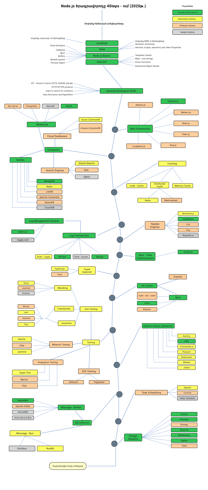

# Node.js ծրագրավորողի ուսուցման պլանը

> [Node.js](https://nodejs.org/en/) ծրագրավորող դառնալու ուսումնառության պլանը [4Steps](https://4steps.am)-ում (2020թ․):

Ստորև կտեսնեք մի գծագիր, որը ցույց է տալիս Node.js ծրագրավորող դառնալու համար նախատեսված ուղիները և գրադարանները։ Գծագրի պատրաստման նպատակն է ուղղորդելու բոլոր նրանց, ովքեր ինձ հարցնում են՝ **«Ի՞նչ պետք է սովորեմ որպեսզի դառնամ Node.js ծրագրավորող»:**

## Ուղղորդում

> Գծագրի նպատակը՝ տալ գաղափար ուղիների մասին։ Եթե ինչ֊որ մաս արդեն սովորել եք, գծագիրը ցույց կտա, թե ինչ պետք է սովորել հաջորդ քայլում՝ այն ինչը ներկայումս նորաձև է և թրենդի մեջ է։

## Ուսուցման պլան

## Ռեսուրսներ

1. Նախադրյալներ

   - [JavaScript](https://www.w3schools.com/js/)
     - [Eloquent JavaScript: A Modern Introduction to Programming](https://eloquentjavascript.net/)
     - [You Don't Know JS Yet (book series)](https://github.com/getify/You-Dont-Know-JS)
   - [NPM](https://docs.npmjs.com/)
   - [Node.js](https://nodejs.org/en/docs/)
     - [Learning Node.js Development](https://www.amazon.com/Learning-Node-js-Development-fundamentals-applications-ebook/dp/B077XFXWH9/ref=sr_1_20?dchild=1&keywords=nodejs&qid=1598782765&sr=8-20)
     - [Node.js Notes for Professionals](https://books.goalkicker.com/NodeJSBook/)   
   - ES6/ES7

2. Ընդհանուր ծրագրավորման հմտություններ

   - Սովորեք GIT, կառուցեք Ձեր repo-ն GiHub-ում, կիսվեք կոդով այլ ծրագրավորողների հետ
     - [Pro Git](https://git-scm.com/book/en/v2)
   - HTTP(S) պրատակոլի և հարցման մեթոդների իմացություն (GET, POST, PUT, PATCH, DELETE, OPTIONS)
   - Ուսումնասիրեք ալգորիթմների և տվյալների կառուցվածքների մասին գրքեր
     - [Introduction to Algorithms](https://www.amazon.com/Introduction-Algorithms-3rd-MIT-Press/dp/0262033844/ref=sr_1_1?dchild=1&qid=1598781619&refinements=p_lbr_one_browse-bin%3AThomas+H.+Cormen&s=books&sr=1-1)
     - [Algorithms Unlocked](https://www.amazon.com/Algorithms-Unlocked-Press-Thomas-Cormen/dp/0262518805)
     - [The Art of Computer Programming](https://www.amazon.com/Computer-Programming-Volumes-1-4A-Boxed/dp/0321751043/ref=sr_1_1?crid=6B0FFK7IA5DV&dchild=1&keywords=knuth+algorithms&qid=1598781938&s=books&sprefix=knuth%2Cstripbooks-intl-ship%2C267&sr=1-1)
      

3. Web Frameworks

   1. **[Express.js](https://expressjs.com/)**
      - [Beginning Node.js, Express & MongoDB Development](https://www.amazon.com/Beginning-Node-js-Express-MongoDB-Development/dp/1078379556/ref=sr_1_5?crid=1WG2TMKRHD4J9&dchild=1&keywords=express.js&qid=1598783438&s=books&sprefix=express%2Cstripbooks-intl-ship%2C303&sr=1-5)
      - [Web Development with Node and Express: Leveraging the JavaScript Stack](https://www.amazon.com/Web-Development-Node-Express-Leveraging/dp/1492053511/ref=sr_1_1?crid=1WG2TMKRHD4J9&dchild=1&keywords=express.js&qid=1598783686&s=books&sprefix=express%2Cstripbooks-intl-ship%2C303&sr=1-1)
   2. [Adonis.js](https://adonisjs.com/)
   3. [Meteor.js](https://www.meteor.com/)
   4. [Nest.js](https://nestjs.com/)
   5. [Sails.js](https://sailsjs.com/)
   6. [Koa.js](https://koajs.com/)
   7. [Loopback.js](https://loopback.io/)
   8. [egg.js](https://eggjs.org/en/index.html)
   9. [midway](https://midwayjs.org/midway/en/)

4. Տվյալների բազաներ

   1. Relational
      1. [SQL Server](https://www.microsoft.com/en-us/sql-server/sql-server-2017)
      2. [PostgreSQL](https://www.postgresql.org/)
      3. [MariaDB](https://mariadb.org/)
      4. [MySQL](https://www.mysql.com/)
   2. Cloud Databases
      - [CosmosDB](https://docs.microsoft.com/en-us/azure/cosmos-db)
      - [DynamoDB](https://aws.amazon.com/dynamodb/)
   3. Search Engines
      - [ElasticSearch](https://www.elastic.co/)
      - [Solr](http://lucene.apache.org/solr/)
      - [Sphinx](http://sphinxsearch.com/)
   4. **NoSQL**
      - **[MongoDB](https://www.mongodb.com/)**
      - [Redis](https://redis.io/)
      - [Apache Cassandra](http://cassandra.apache.org/)
      - [LiteDB](https://github.com/mbdavid/LiteDB)
      - [RavenDB](https://github.com/ravendb/ravendb)
      - [CouchDB](http://couchdb.apache.org/)

5. Քեշավորում

   1. [Node-Cache](https://www.npmjs.com/package/node-cache)
   2. Բաշխված քեշավորում
      1. [Redis](https://redis.io/)
      2. [Memcached](https://memcached.org/)
   3. [Memory Cache](https://www.npmjs.com/package/memory-cache)

6. Լոգավորում

   1. **Log Frameworks**
      - [Node-Loggly](https://www.loggly.com/docs/node-js-logs-2/)
      - **[Winston](https://github.com/winstonjs/winston)**
      - [Node-Bunyan](https://github.com/trentm/node-bunyan)
      - **[Morgan](https://github.com/expressjs/morgan)**
   2. **Log Management System**
      - **[Sentry.io](http://sentry.io)**
      - [Loggly.com](https://loggly.com)

7. **Template Engines**
   1. [Mustache.js](https://mustache.github.io/)
   2. **[Handlebars](https://handlebarsjs.com/)**
   3. [EJS](https://ejs.co/)
   4. [Pug](https://pugjs.org/api/getting-started.html)
   4. [Nunjunks.js](https://mozilla.github.io/nunjucks/)
8. **Real-Time Communication**

   1. **[Socket.IO](https://socket.io/)**

9. Typed Superset

    1. [TypeScript](https://www.typescriptlang.org/)
    2. [Flow](https://flow.org/)

10. API Clients

    1. **REST**
       - [Request](https://github.com/request/request)
       - [Node-Rest-Client](https://www.npmjs.com/package/node-rest-client)
       - **[Axios](https://github.com/axios/axios)**
    2. [GraphQL](https://graphql.org/)

11. Ցանկալի է իմանալ

    - [Async.js](https://caolan.github.io/async/)
    - **[PM2](http://pm2.keymetrics.io/)**
    - [Commander.js](https://github.com/tj/commander.js/)
    - [Passport](http://www.passportjs.org/)
    - **[Nodemailer](https://nodemailer.com/about/)**
    - [Marked](https://marked.js.org/#/README.md#README.md)
    - [JSHint](https://github.com/jshint/jshint)

12. Թեստավորում

    1. Unit, Behavior, Integration Testing
       1. **[Jest](https://jestjs.io/)**
       2. [Jasmine](https://jasmine.github.io/)
       3. [Chai](https://www.chaijs.com/)
       4. [Mocha](https://mochajs.org/)
       5. [Enzyme](https://github.com/airbnb/enzyme)
       6. [Sinon](https://sinonjs.org/)
    2. E2E Testing
       - [Selenium](https://help.crossbrowsertesting.com/selenium-testing/getting-started/javascript/)
       - [Puppeteer](https://github.com/GoogleChrome/puppeteer)

13. Task Scheduling

    - [Agenda](https://github.com/agenda/agenda)
    - [Cronicle](https://github.com/jhuckaby/Cronicle)
    - [Node-Schedule](https://www.npmjs.com/package/node-schedule)
    
14. MicroServices

    1. **Message-Broker**
       - **[RabbitMQ](https://www.rabbitmq.com/tutorials/tutorial-one-javascript.html)**
       - [Apache Kafka](https://www.npmjs.com/package/kafka-node)
       - [ActiveMQ](https://github.com/apache/activemq)
       - [Azure Service Bus](https://docs.microsoft.com/en-us/azure/service-bus-messaging/service-bus-messaging-overview)
    2. Message-Bus
       - [Distribus](https://distribus.com/)
       - [BusMQ](https://github.com/capriza/node-busmq)

15. [Design-Patterns](https://www.pluralsight.com/courses/javascript-practical-design-patterns)
16. [JavaScript Algorithms and Data Structures](https://github.com/trekhleb/javascript-algorithms/)

## Եզրակացություն

Եթե կարծում եք, որ ուսումնական պլանը կարող է բարելավվել, բացեք pull request կամ ավելացրեք ցանկացած issues: Կարող եք repo-ն ավելացնել Ձեր «աստղիկ»֊ներում հետագա թարմացումներին տեղեկացված լինելու համար

Գաղափարը -> [այստեղից](https://github.com/aliyr/Nodejs-Developer-Roadmap), շնորհակալություն [Alious](https://github.com/aliyr)